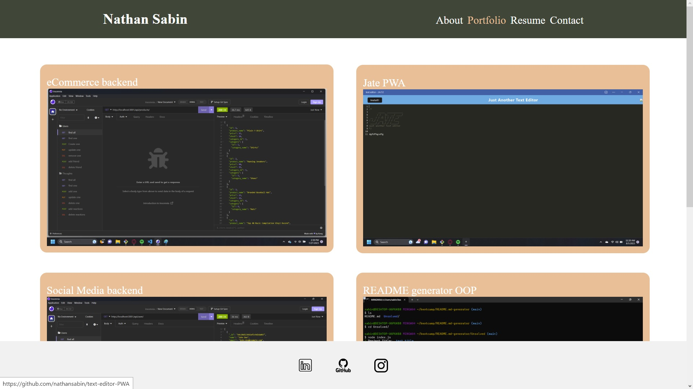

# React Portfolio

## Description

This is a portfolio built using React. It features four main tabs: About, Portfolio, Resume, and Contact.

## Table of Contents

- [Description](#description)
- [Installation](#installation)
- [Usage](#usage)
- [Credits](#credits)
- [License](#license)
- [Test](#test)
- [Questions](#questions)

## Installation

To view the portfolio, please visit the following link:

[Portfolio Link](#insert-your-portfolio-link-here)

## Usage

This portfolio allows you to explore my projects, social media presence, and send emails to me.

## Credits

I am the sole creator of this project.

## Test

This project is designed to be accessible on both mobile and desktop devices. The email feature provides warnings if the correct formatting is not followed.

## Questions

If you have any questions or would like to get in touch, you can find me on GitHub:

GitHub: [nathansabin](https://github.com/nathansabin)

You can also reach me via email at: sabinnat001@outlook.com

